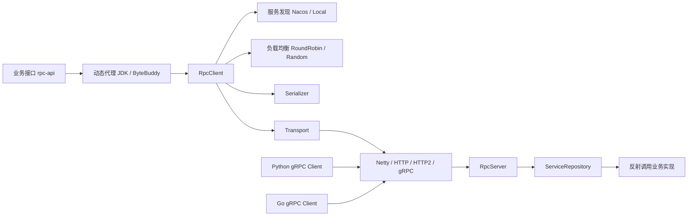

# 🚀 XiaoYu RPC Framework

> 一个基于 Java 17、Netty、Nacos、Protobuf 和 ByteBuddy 实现的轻量级 RPC 学习框架。
>
> 项目重点覆盖 RPC 核心链路：**动态代理 → 服务发现 → 负载均衡 → 序列化 → 网络传输 → 服务端反射调用 → 响应回传**，并提供 HTTP/1.1、HTTP/2、gRPC 与自定义 Netty 协议的实现。


---

## 📖 项目简介

XiaoYu RPC 是一个用于学习和实践分布式 RPC 原理的 Java 项目。

相比只完成“客户端发请求、服务端返回结果”的简单 Demo，本项目进一步实现了：

- 自定义 SPI 扩展机制
- JDK / ByteBuddy 动态代理
- Nacos / Local 服务注册与发现
- RoundRobin / Random 负载均衡
- Protobuf / Kryo / JSON / Java 多种序列化方式
- 自定义 Netty、HTTP/1.1、HTTP/2、gRPC 多协议支持
- 基于 `requestId` 的异步请求响应关联
- Netty 连接复用与连接缓存
- Spring Boot Starter
- Python / Go 标准 gRPC 客户端互操作示例
- JUnit、集成测试、JMH 与端到端压测

这个项目更关注 **RPC 框架内部是如何工作的**，而不是直接替代 Dubbo、gRPC 等成熟生产框架。

---

## ✨ 核心特性

### 1. 插件化 SPI 架构

框架通过自定义 `ExtensionLoader` 从 `META-INF/rpc/` 中加载扩展实现，将核心能力拆成独立扩展点：

| 扩展点 | 当前实现 |
| --- | --- |
| `Transport` | Netty |
| `Protocol` | Netty / HTTP / HTTP2 / gRPC |
| `Serializer` | Protobuf / Kryo / JSON / Java |
| `LoadBalancer` | RoundRobin / Random |
| `ServiceRegistry` / `ServiceDiscovery` | Nacos / Local |
| `ProxyFactory` | JDK / ByteBuddy |

新增实现时不需要修改核心调用流程，注册到 SPI 配置文件即可使用。

### 2. 多协议通信

当前传输模块支持：

- `netty`：自定义二进制 RPC 协议
- `http`：HTTP/1.1
- `http2`：HTTP/2
- `grpc`：基于 HTTP/2 + Protobuf 的 gRPC 兼容实现
- `auto`：服务端协议嗅探模式

### 3. 异步请求关联

客户端发送请求前生成唯一 `requestId`，并使用 `CompletableFuture` 保存请求上下文。服务端响应返回后，根据 `requestId` 找到对应 Future，从而支持单连接上的并发请求关联。

### 4. 服务注册与发现

- Nacos：支持服务注册、发现、订阅和本地缓存
- Local：使用本地内存注册表，适合测试与本地调试

### 5. 跨语言 gRPC

仓库提供：

- `python_client`
- `go_client`

两个标准 gRPC 客户端示例，用于验证非 Java 客户端调用 Java Provider 的能力。

---

## 🏗️ 项目架构



### 一次 RPC 调用的大致流程

```text
Consumer
   │
   │ 1. 调用代理对象
   ▼
JDK / ByteBuddy Proxy
   │
   │ 2. 构造 RpcRequest
   ▼
RpcClient
   │
   ├─ 3. 服务发现
   ├─ 4. 负载均衡
   ├─ 5. 参数序列化
   ▼
Transport / Protocol
   │
   │ 6. 网络发送
   ▼
Provider
   │
   ├─ 7. 反序列化参数
   ├─ 8. 定位服务实现
   ├─ 9. 反射调用目标方法
   ▼
RpcResponse
   │
   │ 10. requestId 匹配 CompletableFuture
   ▼
Consumer 获得结果
```

---

## 📦 模块说明

| 模块 | 作用 |
| --- | --- |
| `rpc-api` | 示例服务接口定义 |
| `rpc-common` | SPI、序列化、Protobuf 请求响应模型等公共能力 |
| `rpc-core` | 动态代理、服务注册发现、负载均衡、客户端/服务端核心抽象 |
| `rpc-transport-netty` | Netty 网络传输与多协议实现 |
| `rpc-provider` | Provider 示例应用 |
| `rpc-consumer` | Consumer 与端到端压测示例 |
| `rpc-spring-boot-starter` | Spring Boot 自动配置、`@RpcService`、`@RpcReference` |
| `rpc-benchmark` | JMH 基准测试 |
| `python_client` | Python gRPC 客户端示例 |
| `go_client` | Go gRPC 客户端示例 |

---

## 🧰 技术栈

- Java 17
- Maven
- Netty 4.1.x
- Nacos 2.x
- Protobuf
- Kryo
- ByteBuddy
- Spring Boot
- JUnit 5
- JMH
- GitHub Actions

---

## 🚀 快速开始

### 1. 环境要求

- JDK 17+
- Maven 3.8+
- Docker（使用 Nacos 时推荐）

### 2. 启动 Nacos

```bash
docker run --name nacos-standalone \
  -e MODE=standalone \
  -p 8848:8848 \
  -p 9848:9848 \
  -d nacos/nacos-server:v2.4.3-slim
```

如果只想本地验证 RPC，也可以将注册中心切换为 `local`，不依赖 Nacos。

### 3. 构建项目

```bash
mvn clean package -DskipTests
```

### 4. 启动 Provider

最简单的方式是在 IDE 中直接运行：

```text
rpc-provider/src/main/java/com/xiaoyu/rpc/provider/ProviderApp.java
```

Linux / macOS 也可以使用命令行：

```bash
java -cp rpc-provider/target/rpc-provider-1.0-SNAPSHOT.jar:\
rpc-transport-netty/target/rpc-transport-netty-1.0-SNAPSHOT.jar:\
rpc-core/target/rpc-core-1.0-SNAPSHOT.jar:\
rpc-common/target/rpc-common-1.0-SNAPSHOT.jar:\
rpc-api/target/rpc-api-1.0-SNAPSHOT.jar:\
$(mvn -q dependency:build-classpath -Dmdep.outputFile=/dev/stdout -pl rpc-provider -am) \
com.xiaoyu.rpc.provider.ProviderApp
```

### 5. 启动 Consumer

IDE 中运行：

```text
rpc-consumer/src/main/java/com/xiaoyu/rpc/consumer/ConsumerApp.java
```

或使用命令行：

```bash
java -cp rpc-consumer/target/rpc-consumer-1.0-SNAPSHOT.jar:\
rpc-transport-netty/target/rpc-transport-netty-1.0-SNAPSHOT.jar:\
rpc-core/target/rpc-core-1.0-SNAPSHOT.jar:\
rpc-common/target/rpc-common-1.0-SNAPSHOT.jar:\
rpc-api/target/rpc-api-1.0-SNAPSHOT.jar:\
$(mvn -q dependency:build-classpath -Dmdep.outputFile=/dev/stdout -pl rpc-consumer -am) \
com.xiaoyu.rpc.consumer.ConsumerApp
```

---

## ⚙️ 配置

核心配置位于：

```text
rpc-core/src/main/resources/rpc-config.yaml
```

当前默认配置：

```yaml
rpc:
  protocol: "netty"
  server-host: "127.0.0.1"
  server-port: 8080
  registry: "nacos"
  registry-address: "127.0.0.1:8848"
  serializer: "protobuf"
  proxy: "bytebuddy"
  load-balancer: "roundrobin"
  max-message-size: 8388608
  worker-threads: 0
  boss-threads: 1
  max-connections: 100
```

常用可选值：

```text
protocol:       netty / http / http2 / grpc / auto
registry:       nacos / local
serializer:     protobuf / kryo / json / java
proxy:          bytebuddy / jdk
load-balancer:  roundrobin / random
```

也可以通过 JVM System Property 覆盖部分配置，例如：

```bash
java -Drpc.registry=local \
     -Drpc.protocol=netty \
     -Drpc.serializer=protobuf \
     ...
```

---

## 🔌 如何扩展 SPI

以新增一个序列化器为例。

### 1. 实现接口

```java
public class MySerializer implements Serializer {
    // serialize / deserialize ...
}
```

### 2. 注册 SPI

在：

```text
src/main/resources/META-INF/rpc/com.xiaoyu.rpc.common.serialization.Serializer
```

加入：

```properties
my=com.example.MySerializer
```

### 3. 修改配置

```yaml
rpc:
  serializer: my
```

`ExtensionLoader` 会按名称加载并缓存对应实现。

---

## 🌱 Spring Boot Starter

项目提供 `rpc-spring-boot-starter`，支持通过注解暴露和引用 RPC 服务。

### Provider

```java
@RpcService
public class HelloServiceImpl implements HelloService {
    @Override
    public String sayHello(String name) {
        return "Hello, " + name;
    }
}
```

### Consumer

```java
@RpcReference
private HelloService helloService;
```

### application.yml 示例

```yaml
rpc:
  protocol: netty
  server-port: 8080
  registry: nacos
  serializer: protobuf
  server-enabled: true
```

纯消费者应用可以设置：

```yaml
rpc:
  server-enabled: false
```

---

## 🌐 Python / Go gRPC 调用

跨语言调用时，将 Provider 配置切换为：

```yaml
rpc:
  protocol: grpc
  serializer: protobuf
  registry: nacos
```

### Python

```bash
cd python_client
python3 -m venv venv
source venv/bin/activate
pip install grpcio grpcio-tools protobuf
python3 client.py
```

### Go

```bash
cd go_client
go run main.go
```

---

## ✅ 测试

### 单元测试

```bash
mvn test -pl rpc-core,rpc-transport-netty
```

### 集成测试

使用 Local Registry 可以减少测试对外部 Nacos 的依赖：

```bash
mvn test -pl rpc-consumer -am \
  -Dtest=FullIntegrationTest \
  -Drpc.registry=local
```

### CI

GitHub Actions 当前会执行：

- Maven 构建
- `rpc-core` / `rpc-transport-netty` 单元测试
- Consumer 集成测试
- JaCoCo 覆盖率报告生成
- Maven verify

工作流文件：`.github/workflows/ci.yml`

---

## 📊 性能测试

### JMH

项目提供独立 `rpc-benchmark` 模块：

```bash
mvn -pl rpc-benchmark -am clean package -DskipTests
java -jar rpc-benchmark/target/benchmarks.jar
```

建议在固定硬件、固定 JVM 参数和相同负载下比较结果，不将本地 benchmark 直接等同于生产环境性能。

### 端到端压测

`rpc-consumer` 中提供 `LoadTestApp`，支持：

- 并发线程数
- 预热时间
- 测试持续时间
- Payload 大小
- QPS
- 成功率 / 错误率
- 平均延迟
- P50 / P95 / P99
- GC / Heap 基础统计

仓库当前提交的一次本地测试结果：

| 指标 | 结果 |
| --- | ---: |
| 并发线程 | 200 |
| 持续时间 | 30 s |
| 总请求数 | 471,906 |
| 成功请求 | 471,906 |
| 错误率 | 0.00% |
| QPS | 15,721.79 |
| 平均延迟 | 12.716 ms |
| P95 | 18.914 ms |
| P99 | 24.701 ms |

> 以上数据来自仓库中的 `loadtest-results.txt`，仅代表对应机器和测试条件下的一次结果。

---

## 🧭 后续改进方向

这个项目仍然有不少值得继续深入的工程化方向：

- [ ] 增加客户端请求级超时、重试与取消机制
- [ ] 将业务方法执行从 Netty I/O EventLoop 隔离到独立业务线程池
- [ ] 完善连接池高并发建连与连接回收逻辑
- [ ] 统一 YAML、System Property 与 Spring Boot 的配置覆盖规则
- [ ] 增加健康检查、熔断、限流和降级机制
- [ ] 增加 Micrometer / Prometheus 指标
- [ ] 增加 OpenTelemetry 链路追踪
- [ ] 增加更多异常场景与并发测试
- [ ] 增加 Docker Compose 一键启动示例
- [ ] 完善发布流程与版本管理

---

## 📚 项目适合学习什么

如果你正在学习 Java 后端或准备面试，可以从这个项目重点理解：

1. RPC 为什么需要动态代理？
2. RPC 请求如何描述“接口、方法、参数类型和参数值”？
3. 序列化器为什么要做成可插拔组件？
4. Netty 如何实现连接复用和异步请求？
5. `requestId + CompletableFuture` 如何完成响应关联？
6. 注册中心和负载均衡在 RPC 调用中分别负责什么？
7. HTTP/1.1、HTTP/2、自定义二进制协议和 gRPC 有什么差异？
8. 一个 RPC 框架如何设计 SPI 和模块边界？
9. 为什么压测需要区分吞吐量、平均延迟和 P99？
10. 框架如何进一步演进到超时、重试、熔断、限流、监控和链路追踪？

---

## 🤝 贡献

欢迎提交 Issue 或 Pull Request。

如果这个项目对你理解 RPC、Netty 或分布式系统有所帮助，欢迎 Star。
