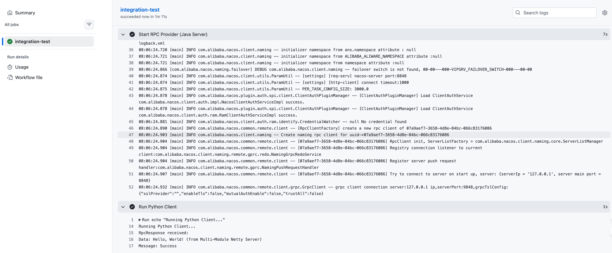
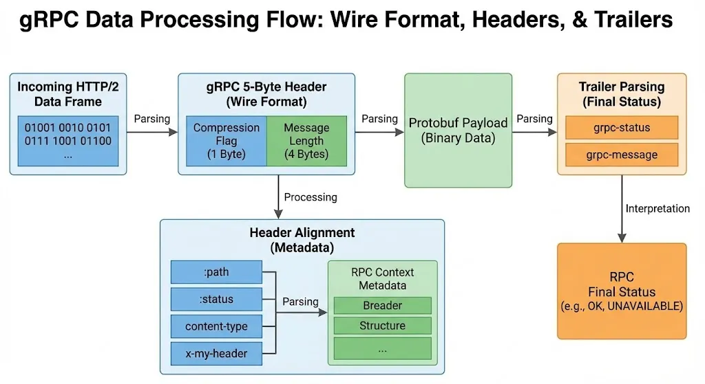

# 🚀 XiaoYu RPC Framework

> A lightweight, high-performance, and extensible RPC framework based on **Netty**, **Nacos**, and **ByteBuddy**.
> Supports multiple protocols including **HTTP/2**, **HTTP/1.1**, and custom **Netty** protocols.


---

## 📖 Introduction

This project is a high-performance, pluggable RPC framework designed to demonstrate the convergence of standard protocols and dynamic invocation.
Unlike traditional RPC frameworks that bind tightly to a single protocol or require strict code generation for every service, **XiaoYu RPC** features a unique **"Universal gRPC Adapter"**. It implements the standard gRPC protocol (HTTP/2 + Protobuf) but routes requests dynamically to Java service implementations. This allows you to:

1. **Use standard gRPC clients** (like Python, Go, Node.js) to call your Java services directly.
2. **Retain Java's dynamic flexibility** (Reflection/ByteBuddy) without generating separate `.proto` service stubs for every business class.


## 🏗️ Project Architecture

The project is organized into the following modules to ensure separation of concerns and maintainability:

| Module | Description |
|--------|-------------|
| **`rpc-api`** | Defines service interfaces. Shared between Provider and Consumer. |
| **`rpc-common`** | Common utilities, Value Objects (`RpcRequest`, `RpcResponse`), and Protobuf definitions (`rpc_meta.proto`). |
| **`rpc-core`** | The core framework implementation. Contains SPI interfaces, Dynamic Proxy, and Registry logic. **Netty-free**. |
| **`rpc-transport-netty`** | The default transport implementation based on **Netty**. |
| **`rpc-provider`** | Example provider application that implements and exports services. |
| **`rpc-consumer`** | Example consumer application that imports and invokes services. |
| **`python_client`** | Python client implementation demonstrating cross-language gRPC interoperability. |

## ✨ Key Features

- **🔌 Plugin-based Architecture**: Leverages a custom SPI mechanism for maximum flexibility.
- **🤝 Universal gRPC Compatibility**: A custom-implemented `GrpcProtocol` layer that runs standard gRPC on HTTP/2, proven to interoperate with official `grpc-python` clients.
- **⚡ Dynamic-Static Hybrid**: Combines the performance of Protobuf serialization (with custom Type Wrappers) and the flexibility of Java dynamic proxies.
- **🚀 Pluggable Transport**: Fully decoupled transport layer. Default implementation is `rpc-transport-netty`, but can be swapped for Tomcat/Socket.
- **📡 Multi-Protocol Support**: Choice of `Netty` (Custom), `HTTP/1.1`, or `gRPC` (HTTP/2) for communication.
- **⚡ High-Performance Proxy**: Uses **ByteBuddy** for dynamic proxy generation, optimized for Java 17+.
- **⚖️ Intelligent Load Balancing**: Includes `RoundRobin` and `Random` strategies.
- **📦 Diverse Serialization**: Supports `Protobuf` (Enhanced with Scalar Wrappers), `Kryo`, `JSON`, and standard `Java` serialization.
- **🔍 Service Discovery**: Integrated with **Nacos** for robust service registry and discovery.

---

##  Quick Start

### 1. Prerequisites (Nacos)

Start Nacos using Docker:

```bash
docker run --name nacos-standalone \
    -e MODE=standalone \
    -p 8848:8848 \
    -p 9848:9848 \
    -d nacos/nacos-server:v2.3.1-slim
```

### 2. Run the Provider

Execute the following commands to start the Java RPC Provider. This will build the project and register the `HelloService` to your local Nacos instance.

```bash
# 1. Build Project
mvn clean package -DskipTests

# 2. Start Provider
java -cp rpc-provider/target/rpc-provider-1.0-SNAPSHOT.jar:rpc-transport-netty/target/rpc-transport-netty-1.0-SNAPSHOT.jar:rpc-core/target/rpc-core-1.0-SNAPSHOT.jar:rpc-common/target/rpc-common-1.0-SNAPSHOT.jar:rpc-api/target/rpc-api-1.0-SNAPSHOT.jar:$(mvn -q dependency:build-classpath -Dmdep.outputFile=/dev/stdout -pl rpc-provider -am) com.xiaoyu.rpc.provider.ProviderApp
```

### 3. Run the Consumer

Execute the `ConsumerApp` in the `rpc-consumer` module to make calls to the provider.

```bash
java -cp rpc-consumer/target/rpc-consumer-1.0-SNAPSHOT.jar:rpc-transport-netty/target/rpc-transport-netty-1.0-SNAPSHOT.jar:rpc-core/target/rpc-core-1.0-SNAPSHOT.jar:rpc-common/target/rpc-common-1.0-SNAPSHOT.jar:rpc-api/target/rpc-api-1.0-SNAPSHOT.jar:$(mvn -q dependency:build-classpath -Dmdep.outputFile=/dev/stdout -pl rpc-consumer -am) com.xiaoyu.rpc.consumer.ConsumerApp
```

### 4. Running Tests

**Unit Tests**:
Run the comprehensive unit test suite covering SPI, serializers, load balancers, and protocols:

```bash
mvn test -pl rpc-core,rpc-transport-netty
```

**Integration Tests**:
Run the full integration test suite:

```bash
mvn test -pl rpc-consumer -Dtest=FullIntegrationTest
```

---

## 🛠️ Configuration

Configure the framework via `rpc-core/src/main/resources/rpc-config.yaml`.

```yaml
rpc:
  transport: "netty"         # Transport: netty (default)
  protocol: "http2"          # Protocol: netty, http, http2
  server-host: 127.0.0.1
  server-port: 8080
  registry: "nacos"          # Registry: nacos, local
  registry-address: "127.0.0.1:8848"
  serializer: KRYO           # Serializer: PROTOBUF, KRYO, JAVA, JSON
  proxy: bytebuddy           # Proxy: jdk, bytebuddy
  load-balancer: roundrobin  # Load Balancer: roundrobin, random
```

## 🔌 SPI Design & Ecosystem

XiaoYu RPC adheres to the **Microkernel Architecture**, where the core (`rpc-core`) only provides the lifecycle management and SPI (Service Provider Interface) definitions, while all specific functionalities are implemented as plugins. This design ensures the framework is highly extensible, lightweight, and follows the **Open-Closed Principle**.

### 🧩 Core Extension Points

We strictly define interfaces to decouple every major component:

| Interface | Description | Default Impl | Purpose |
|-----------|-------------|--------------|---------|
| **`Transport`** | Abstraction of network communication. Decouples the underlying I/O framework. | `NettyTransport` | Allow switching between Netty, Tomcat, or Socket without changing core logic. |
| **`Protocol`** | Message protocol definition. Controls how bytes are framed and processed. | `NettyProtocol` | Support multiple protocols (Custom RPC, gRPC, HTTP) on the same port. |
| **`Serializer`** | Object serialization strategy. | `ProtoBuf` | Balance performance (Protobuf/Kryo) vs Compatibility (JSON/Java). |
| **`LoadBalancer`** | Client-side load balancing strategy. | `RoundRobin` | Distribute traffic evenly or randomly to providers. |
| **`ServiceRegistry`** | Service registration and discovery. | `Nacos`, `Local` | Decouple from specific registry backend (swap Nacos for Zookeeper/Consul easily). |
| **`ProxyFactory`** | Dynamic proxy generation strategy. | `ByteBuddy` | Optimization for different JDK versions (ByteBuddy works best on Java 17+). |

### 🛠️ ExtensionLoader

We implemented a powerful loading mechanism similar to Dubbo's `ExtensionLoader`. It scans `META-INF/rpc/` for configuration files and loads implementation classes lazily by name.

### How to Add a New Extension

1. **Implement the Interface**: Create a class that implements the target SPI interface (e.g., `Serializer`).
2. **Create SPI Configuration File**:
   - Create a file in `src/main/resources/META-INF/rpc/`
   - Filename must match the fully qualified interface name (e.g., `com.xiaoyu.rpc.common.serialization.Serializer`).
3. **Register the Implementation**: Add a key-value pair to the file:
   ```properties
   my-serializer=com.example.MyCustomSerializer
   ```
4. **Use It**: update `rpc-config.yaml`:
   ```yaml
   rpc:
     serializer: my-serializer
   ```

## ❓ FAQ

**Q: Why ByteBuddy?**
A: CGLIB is problematic on Java 17+ due to deep reflection restrictions. ByteBuddy is the modern industry standard for bytecode manipulation.

**Q: Connection Timeout/Refusal?**
A: Ensure Nacos is running and the ports `8848` and `9848` are accessible. Check your `rpc-config.yaml` for correct host/port settings.

**Q: How to switch to Local Registry for testing?**
A: Set `registry: "local"` in `rpc-config.yaml`. This bypasses Nacos and uses an in-memory map, useful for unit tests or offline development.


**Q: Encountering "No Transport Found" error?**
A: Make sure you have included `rpc-transport-netty` (or custom transport module) in your runtime dependencies. `rpc-core` does not include a transport implementation by default to ensure modularity.

---

## 🌱 Spring Boot Integration

A dedicated Spring Boot Starter is available: `rpc-spring-boot-starter`.

### Dependency

```xml
<dependency>
    <groupId>com.xiaoyu.rpc</groupId>
    <artifactId>rpc-spring-boot-starter</artifactId>
    <version>1.0-SNAPSHOT</version>
</dependency>
```

### Provider Example

```java
@RpcService
public class HelloServiceImpl implements HelloService {
    @Override
    public String sayHello(String name) {
        return "Hello, " + name;
    }
}
```

### Consumer Example

```java
@RestController
public class HelloController {
    @RpcReference
    private HelloService helloService;

    @GetMapping("/hello")
    public String hello(@RequestParam String name) {
        return helloService.sayHello(name);
    }
}
```

### Configuration (`application.yml`)

```yaml
rpc:
  server-port: 8080
  registry: nacos
  registry-address: 127.0.0.1:8848
  serializer: kryo
  server-enabled: true  # Set to false for consumer-only apps
```

---

## 🐍 Cross-Language gRPC Support (Python)

This framework supports interoperability with standard gRPC clients (e.g., Python), allowing non-Java clients to invoke services hosted by the RPC framework.

### Features

- **Standard gRPC Protocol**: Implements standard HTTP/2 transport compatible with widespread gRPC libraries (via `grpc-io`).
- **Protobuf Serialization**: Supports standard Protobuf `Empty`, `StringValue`, `Int32Value`, etc., via wrapper types for seamless data exchange.
- **Nacos Integration**: Services registered in Nacos can be discovered and invoked.

### Usage Guide

1. **Configure Java Server**:
   Update `rpc-config.yaml` to enable `grpc` protocol and `protobuf` serialization:

   ```yaml
   rpc:
     protocol: "grpc"
     serializer: "protobuf"
     registry: "nacos"
   ```
2. **Start the Java Provider (gRPC Mode)**:
   Run the following commands to build the project and start the server:

   ```bash
   # Build the project (skip tests to speed up)
   mvn clean package -DskipTests

   # Run the Provider
   java -cp rpc-provider/target/rpc-provider-1.0-SNAPSHOT.jar:rpc-transport-netty/target/rpc-transport-netty-1.0-SNAPSHOT.jar:rpc-core/target/rpc-core-1.0-SNAPSHOT.jar:rpc-common/target/rpc-common-1.0-SNAPSHOT.jar:rpc-api/target/rpc-api-1.0-SNAPSHOT.jar:$(mvn -q dependency:build-classpath -Dmdep.outputFile=/dev/stdout -pl rpc-provider -am) com.xiaoyu.rpc.provider.ProviderApp
   ```
3. **Run the Python Client**:
   Navigate to the `python_client` directory and set up the environment:

   ```bash
   cd python_client

   # Create and valid virtual environment
   python3 -m venv venv
   source venv/bin/activate

   # Install dependencies
   pip install grpcio grpcio-tools protobuf

   # Run the client
   python3 client.py
   ```

   **Expected Output**:

   ```text
   RpcResponse received:
   Data: Hello, World! (from Multi-Module Netty Server)
   Message: Success
   ```
## 🔄 Continuous Integration & Delivery (CI/CD)

To ensure system reliability and code quality, this project integrates a robust CI/CD pipeline using **GitHub Actions**. This pipeline automatically validates the build process and runs integration tests upon every push and pull request.

**Key Workflows:**
- **Automated Testing**: Runs unit and integration tests to verify RPC functionality.
- **Service Verification**: Launches Nacos, the Java Provider, and Python Client in a containerized environment to test cross-language interoperability.
- **Build Status**: Provides immediate feedback on code health via GitHub Actions.




---

## 🔬 Technical Deep Dive: gRPC Protocol Implementation

The core of XiaoYu RPC's interoperability lies in its custom implementation of the gRPC wire protocol over Netty's HTTP/2 stack.



### 1. Wire Format (5-Byte Header)

Every gRPC message is prefixed with a 5-byte header, handled directly in `GrpcServerHandler`:

- **Compression Flag (1 Byte)**: `0` (Uncompressed) or `1` (Compressed).
- **Message Length (4 Bytes)**: Big-endian integer specifying the length of the following Protobuf payload.
- **Payload**: Standard Protobuf binary data, deserialized via `NativeProtobufSerializer`.

### 2. Header Alignment

Strict adherence to gRPC HTTP/2 headers ensures compatibility:

- **:status**: `200` (HTTP level success)
- **content-type**: `application/grpc` (Crucial for client recognition)
- **te**: `trailers`

### 3. Trailer & Status

gRPC uses HTTP/2 Trailers to convey the final RPC status, distinct from the HTTP status code.

- **HEADERS Frame (EndStream=true)**: Sent after the data payload.
- **grpc-status**: `0` for OK, non-zero for errors.
- **grpc-message**: Descriptive error message.

---

## 🤝 Contributing

Contributions are welcome! Feel free to open issues or submit pull requests to improve the framework.
